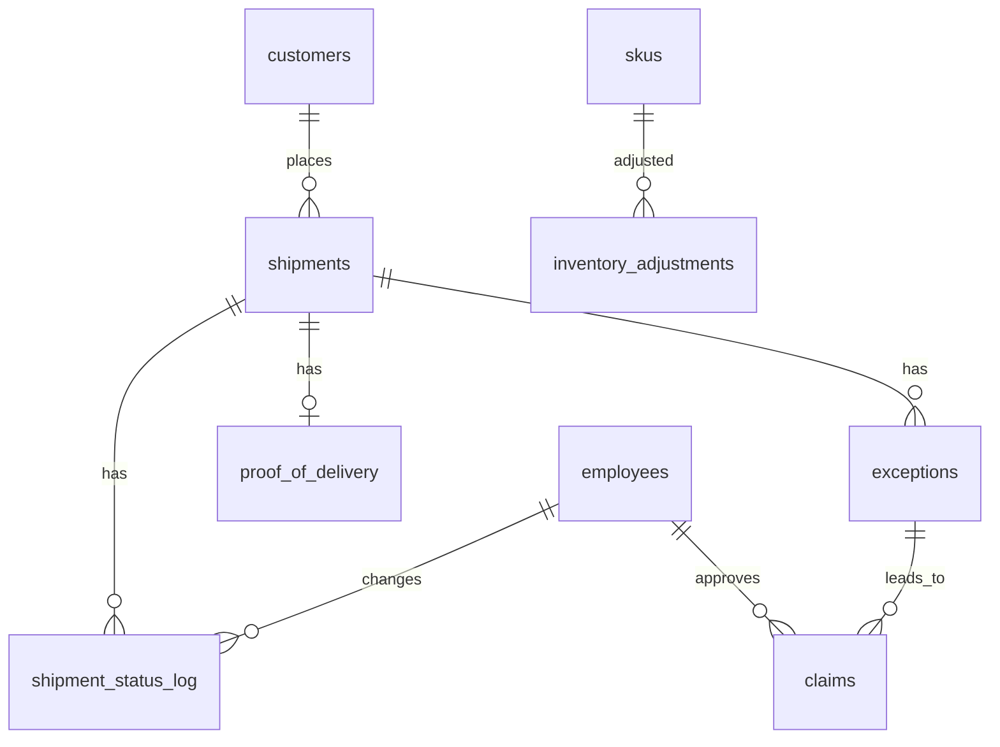

# Transaction-Level SoD & Fraud Risk Testing
### Haneul Freight & Logistics (fictional) · Audit period: Q1 2026 (Jan 2 – Mar 31)

## Why this project

During my logistics operations internship, one role often covered several functions at once: updating shipment data, validating those same records, and handling delivery exceptions. In a small team that is normal, but from an audit perspective it means the person who records a transaction can also review it and act on it.

My first project tested IT general controls at the access level: who *can* do what. This project goes one step further and looks at the transaction level: what people *actually did* with that access, and whether any of it shows signs of fraud or control failure.

The central question: **when full segregation of duties is not realistic for a small operation, how do you detect the risk and what should compensate for it?**

## Scenario

Haneul Freight & Logistics is a fictional 3PL with 18 employees. Operations Coordinators record shipment status, register delivery exceptions, and can approve customer claims up to a system-configured limit. Larger claims require the Operations Manager.

The dataset covers one quarter of activity: ~2,900 shipments, ~11,000 status changes, ~190 delivery exceptions, 85 customer claims, and ~210 inventory adjustments. Control exceptions were deliberately built into the data, alongside realistic noise and false positives, so that results require judgment rather than just a count.

> All names, companies, and records are fictional. No data from any real company was used.

## Frameworks

- **COSO 2013, Principle 8** – the organization considers the potential for fraud in assessing risks
- **COSO 2013, Principle 10** – control activities, including segregation of duties
- Findings are written in 5C format (Condition, Criteria, Cause, Effect, Recommendation)

## Business rules (audit criteria)

| ID | Rule |
|---|---|
| R1 | The person who records a shipment as LOST or DAMAGED must not approve the related claim. |
| R2 | Non-manager claim approvals are limited by `CLAIM_APPROVAL_LIMIT_NON_MANAGER` (authorized value: 500,000 KRW). Claims above the limit require the Operations Manager. |
| R3 | A shipment may have only one paid claim. |
| R4 | A LOST claim is invalid if a proof of delivery (POD) exists for the shipment. |
| R5 | LOST and DAMAGED exceptions must be closed by someone other than the person who registered them. |
| R6 | Inventory adjustments must be approved by someone other than the adjuster. Adjustments valued at 1,000,000 KRW or more require the Operations Manager. |
| R7 | Business hours are Mon–Fri 08:00–19:00. A DELIVERED status must be supported by a POD record. |
| R8 | Every system configuration change must have an approved change ticket. |

## Data dictionary

| Table | Key columns | Notes |
|---|---|---|
| `employees` | emp_id, name, department, job_title, system_role | `system_role` values: OPS_MANAGER, OPS_COORDINATOR, CS_AGENT, WAREHOUSE_LEAD, WAREHOUSE_STAFF, DISPATCH, IT_ADMIN, FINANCE |
| `customers` | customer_id, customer_name, onboarded_at, onboarded_by | |
| `skus` | sku_id, category, unit_cost | unit_cost in KRW |
| `shipments` | shipment_id, customer_id, carrier, declared_value, created_by, created_at | |
| `shipment_status_log` | log_id, shipment_id, status, changed_by, changed_at | Audit trail. Status: CREATED, PICKED, IN_TRANSIT, DELIVERED, DAMAGED, LOST, RETURNED |
| `proof_of_delivery` | pod_id, shipment_id, delivered_at, captured_by | |
| `exceptions` | exception_id, shipment_id, exception_type, registered_by/at, closed_by/at | Types: DELAY, DAMAGED, LOST, ADDRESS_CORRECTION, REFUSED |
| `claims` | claim_id, shipment_id, exception_id, claim_type, claim_amount, submitted_by/at, approved_by/at, status, paid_amount | Status: APPROVED, REJECTED |
| `inventory_adjustments` | adj_id, sku_id, qty_change, reason, adjusted_by/at, approved_by/at | Negative qty = stock written off |
| `system_config_history` | parameter, value, effective_from, effective_to, changed_by, change_ticket | A row applies while `effective_from <= t < effective_to` (NULL = still active) |

Timestamps are stored as text in `YYYY-MM-DD HH:MM:SS` format.



## Control tests

| Test | Rule | What it looks for |
|---|---|---|
| T1 | R1 | Same person recorded LOST/DAMAGED and approved the claim |
| T2 | R2 | Claims clustered just below the approval limit in effect at the time |
| T3 | R3 | Multiple claims on the same shipment |
| T4 | R4 | LOST claims on shipments with a POD |
| T5 | R5 | Exceptions registered and closed by the same person within 24 hours |
| T6 | R6 | Unapproved, self-approved, or under-authorized inventory adjustments |
| T7 | R7 | LOST/DAMAGED changes outside business hours; bulk DELIVERED updates without POD |
| T8 | R2, R8 | Configuration change without a ticket, and claims approved under it |
| T9 | – | Consolidated view: flags per employee |
| T10 | – | Customer concentration of flagged claims and who onboarded those customers |

All test queries are in `queries.sql`.

## Repository

```
haneul_logistics_audit.db            SQLite database
queries.sql                          control test queries (T1–T10)
Haneul_Risk_Assessment_RCM.xlsx      risk assessment, heat maps, RCM, test results, findings log
Haneul_Audit_Report.pdf              audit report with findings in 5C format
generate_data.py                     synthetic data generator (built with AI assistance)
README.md
```

## Key results

- 10 key controls tested: 9 ineffective, 1 control gap
- 3 High findings, 1 Medium, 1 Low observation
- One coordinator recorded losses, closed the reviews and approved the payouts for 14 claims (KRW 11.7M)
- An unauthorized configuration change raised the claim approval limit 4x for 34 days, leading to KRW 8.1M approved above authority
- Not every exception was fraud: a quarter-end bulk status update was a reporting-integrity issue, and one duplicate claim was correctly rejected by the manager

## How to run

Open `haneul_logistics_audit.db` in [DB Browser for SQLite](https://sqlitebrowser.org/) and run the queries under **Execute SQL**. To regenerate the data: `python generate_data.py`.
